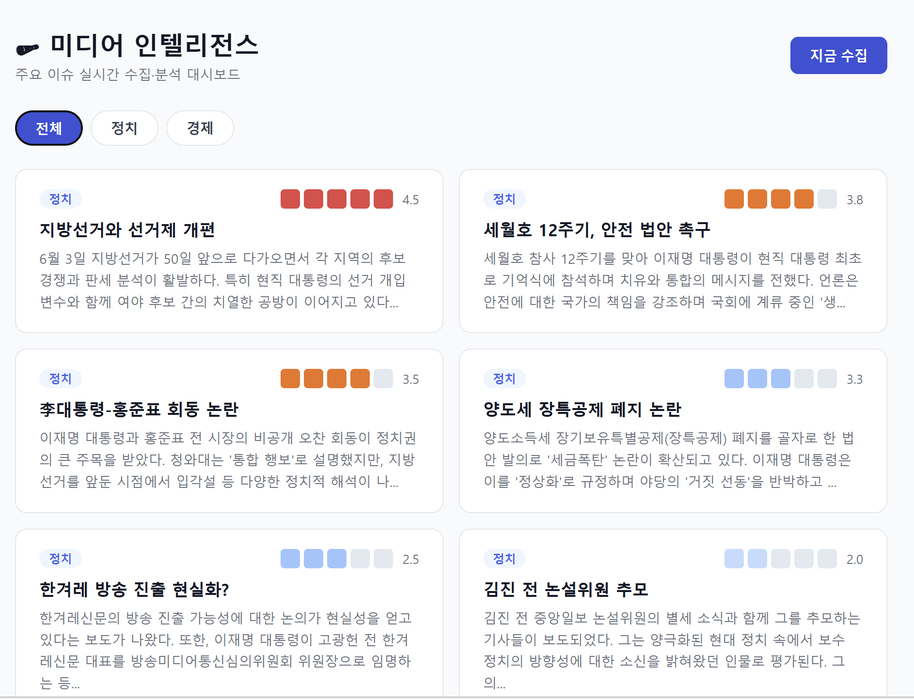

# 🗞 미디어 인텔리전스 대시보드

> **⚠️ 과제 제출용 프로젝트입니다.** <br>
> **⚠️ 실행 초반 자료 수집 과정에서 1~2분 정도 소요될 수 있습니다. Gemini 서버 과부하로 인한 오류가 있을 수 있습니다.**

기자를 위한 AI 기반 뉴스 수집·분석·브리핑 자동화 시스템입니다.  
국내 주요 언론사의 기사를 실시간으로 수집하고, LLM을 통해 매체별 논조를 비교 분석하여 대시보드로 제공합니다.

## 📊 Dashboard



---

## 📌 기획 배경

언론사 기자는 매일 아침 여러 매체를 직접 순회하며 주요 이슈를 파악해야 합니다.  
동일한 사안에 대해 조선일보, 한겨레, 중앙일보 등이 어떤 각도로 보도하는지 비교하는 데 상당한 시간이 소요되며,  
이는 취재 방향 설정의 골든타임을 빼앗는 핵심 페인포인트입니다.

본 시스템은 이 과정을 자동화하여 기자가 아침에 대시보드 하나만 열면  
**오늘의 주요 이슈 / 매체별 논조 차이 / 기사 초안**을 즉시 파악할 수 있도록 합니다.

---

## 🏗 시스템 아키텍처

[수집]
네이버 뉴스 API + 연합뉴스 RSS
↓ APScheduler (30분 간격)
[백엔드 - FastAPI]
수집 파이프라인 → SQLite 저장
↓
이슈 클러스터링 → Gemini 2.5 Flash API 호출
(논조 분석 / 요약 브리핑 / 기사 초안)
↓
REST API → 프론트엔드 제공
[프론트엔드 - React + Vite]
메인 대시보드 → 이슈 상세 → 기사 초안 드래프팅

---

## 🛠 기술 스택

| 레이어       | 기술                                            |
| ------------ | ----------------------------------------------- |
| 프론트엔드   | React (Vite), react-router-dom, recharts, axios |
| 백엔드       | FastAPI, SQLAlchemy, APScheduler                |
| LLM          | Gemini 2.5 Flash (Google AI)                    |
| 데이터베이스 | SQLite                                          |
| 뉴스 수집    | 네이버 뉴스 검색 API, 연합뉴스 RSS              |

---

## ⚙️ 실행 방법

### 사전 준비

1. 네이버 개발자 센터에서 API 키 발급  
   https://developers.naver.com

2. Google AI Studio에서 Gemini API 키 발급  
   https://aistudio.google.com

3. `backend/.env` 파일 생성 (`.env.example` 참고)

```env
GEMINI_API_KEY=your_gemini_api_key_here
NAVER_CLIENT_ID=your_naver_client_id_here
NAVER_CLIENT_SECRET=your_naver_client_secret_here
```

### 실행

**Windows (배치파일 사용)**

```bash
start.bat
```

**수동 실행**

```bash
# 백엔드
cd backend
uv run uvicorn main:app --reload --port 8000

# 프론트엔드 (새 터미널)
cd frontend
npm run dev
```

> ⚠️ 본 저장소에는 시연용 샘플 DB가 포함되어 있습니다.
> 최신 데이터를 원할 경우 대시보드의 '지금 수집' 버튼을 눌러주세요.

### 접속

- 대시보드: http://localhost:5173
- API 문서: http://localhost:8000/docs

---

## 🚀 주요 기능

### 1. 이슈 자동 수집

- 정치 / 경제 분야 키워드 기반 뉴스 자동 수집
- 비교 대상 매체: 조선일보, 중앙일보, 한겨레, 경향신문, 연합뉴스
- 30분 간격 자동 실행

### 2. 매체별 논조 비교

- 동일 이슈에 대한 각 매체의 보도 프레임 분석
- 보수 / 중도 / 진보 논조 스펙트럼 표시
- 비어있는 취재 각도 제안

### 3. 이슈 온도

- 언급량 기반 이슈 중요도 시각화 (1~5 스케일)

### 4. 기사 초안 드래프팅

- 취재 방향 입력 시 LLM 기반 기사 초안 자동 생성
- 제목 후보 3개 + 본문 초안 + 추가 취재 포인트 제공

---

## 🔮 추후 개선 방향

1. **RAG 기반 초안 품질 향상** — 특정 언론사 기사 아카이브를 벡터 DB에 인덱싱하여 특정 언론사 문체에 맞는 초안 생성
2. **BigKinds API 연동** — 한국언론진흥재단 API로 더 정밀한 매체별 논조 비교
3. **실시간 속보 알림** — 이슈 온도 급등 시 즉시 알림 (Slack Webhook)
4. **사용자 커스터마이징** — 기자별 관심 키워드 / 매체 설정

---

## 🤖 AI 도구 사용 고지

| 도구                 | 활용 내용                                                         |
| -------------------- | ----------------------------------------------------------------- |
| Claude (claude.ai)   | 시스템 기획·설계 브레인스토밍, 설계 문서 작성, 코드 리뷰          |
| Gemini 2.5 Flash API | 뉴스 논조 분석, 이슈 요약, 기사 초안 드래프팅 (백엔드에서만 호출) |
